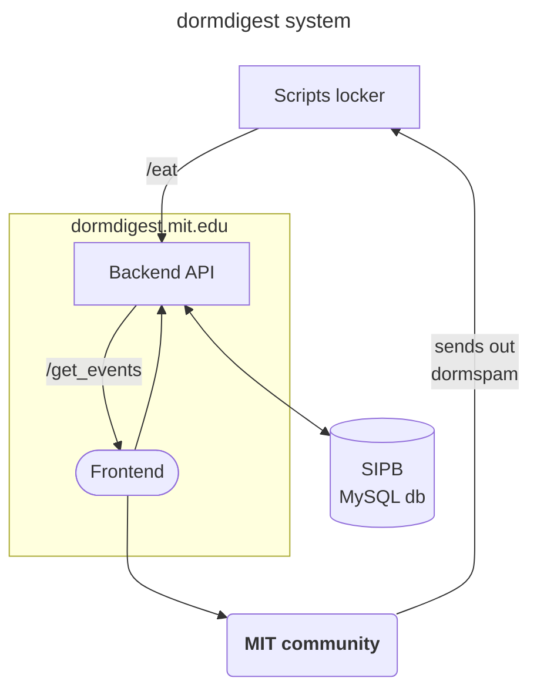

# dormdigest-backend

Backend API server for dormdigest service

```mermaid
---
title: dormdigest system
---
flowchart TB
    Locker[Scripts locker]
    MySQL[(SIPB\nMySQL db)]

    subgraph dormdigest.mit.edu
    Frontend([Frontend]) --> Backend[Backend API]
    Backend -->|/get_events| Frontend
    end

    Humans("`**MIT community**`") -->|sends out\ndormspam| Locker
    Locker -->|/eat| Backend
    MySQL <--> Backend
    Frontend --> Humans

    Backend ~~~ MySQL
```

## Documentation

See [docs](docs) folder.